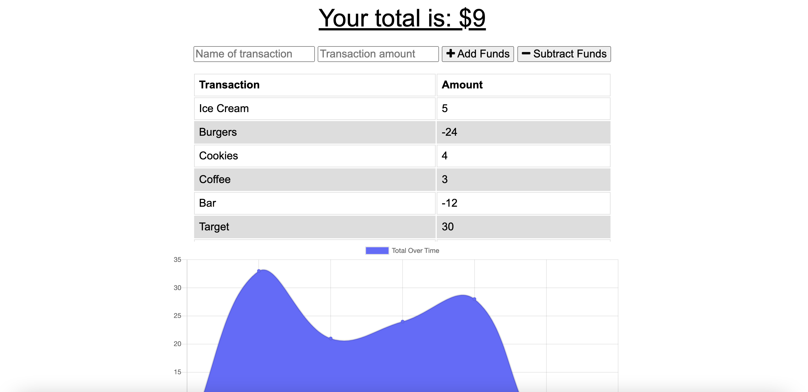

# budget_tracker

<h1> Budget Tracker App </h1>

Links:
* Github Repository: https://github.com/ncerva/budget_tracker
* Deployed Application: 

This budget tracking application allows users to input how much they've spent and also tracks what they've spent their money on. The goal of this application is to have the ability to view costs online and offline. 

